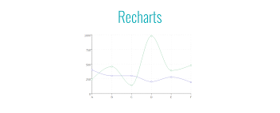

<br />
<div align="center">
  
</div>
<br/>

# The app for the tipsy time traveler in all of us:

This is an application that was created during my time at Code Chrysalis where we are given a single day to build a working MVP.

The purpose of this app is to provide a way to track not only the amount of drinks during a session, but also to track the actual drink, how it was, and with simple geo-tagging, where it (and you) were. All the info gathered in a session is presented in an easy to view dashboard with a visual representation as well as a log of your previous session. Learn your limits, track your consumption, and never again forget where you found your new favorite drink!

## Technologies Used

<div>
React
  
Material UI
  
Redux
  
  <br />
  <br />
Axios
  
React Router
  
Recharts
  
</div>


<br/>

## Getting Started

- Create an account / Login
- Welcome to the dashboard page
- View current / past sessions or start a new one
- Choose drinks based on alcohol type
- Add your chosen drink to your session or learn more about it
- Have fun!

<br/>

## For Developers
Download or clone the project from the repository, [timetravel](https://github.com/mc255v/timetravel)

You will need to install package dependencies:

```sh
$ yarn
```

Start the development server:

```sh
$ yarn start
```

Run the test suite:

```sh
$ yarn test
```

<br/>

## API documentation

The API used to gather information about drinks is from [TheCocktailDB](https://www.thecocktaildb.com)

<br/>

**Coming Soon**

The ability to add drinks to the list, as well as your own creations, with an accompanying photo upload.readme/
